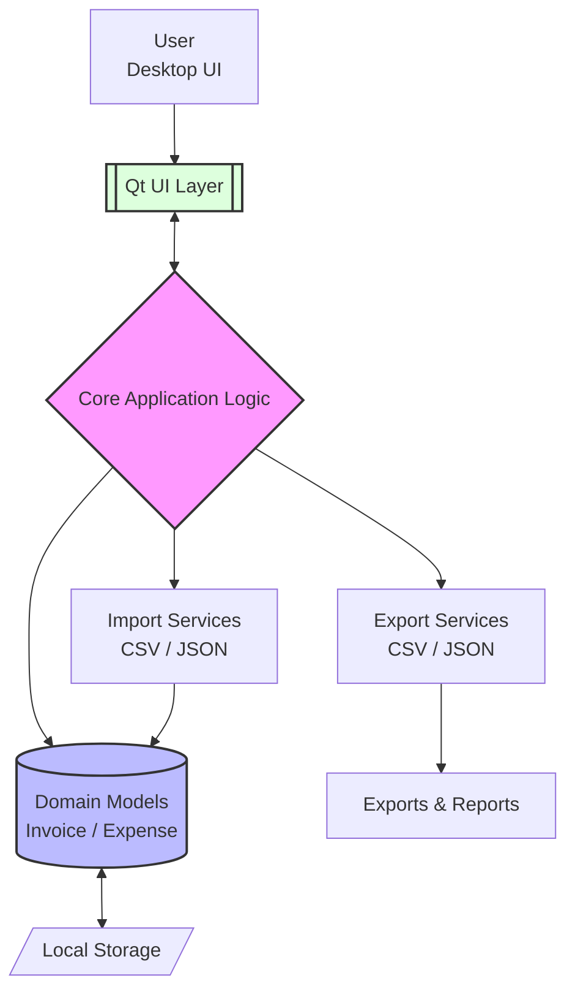

# InvoiceApplication

A C++ / Qt desktop application for managing invoices and expenses, featuring a comprehensive Qt Test suite and integrated code coverage reporting using OpenCppCoverage.

---

## 📋 Table of Contents

- [Prerequisites](#prerequisites)
- [Build Instructions](#build-instructions)
  - [Via Visual Studio](#via-visual-studio)
- [Run the Application](#run-the-application)
  - [Via Visual Studio](#via-visual-studio-1)
  - [Via Command Line](#via-command-line)
- [Run Tests](#run-tests)
  - [Run an Individual Test](#run-an-individual-test)
  - [Run All Tests via CTest](#run-all-tests-via-ctest)
- [Generate Code Coverage](#generate-code-coverage)
  - [Via Visual Studio](#via-visual-studio-2)
  - [Coverage Output](#coverage-output)
- [Application Architecture](#application-architecture)
- [Architectural Components](#architectural-components)
- [Project Structure](#project-structure)
- [License](#license)

---

## Prerequisites

Before building and running the application, ensure you have the following installed:

- **Windows 10 / 11**
- **Visual Studio 2022**
  - Desktop development with C++
  - CMake tools for Windows
- **Qt 6.x**
  - Ensure `Qt6_DIR` is set in your environment variables
- **OpenCppCoverage**
  - Required for the `RunCoverage` utility target

---

## Build Instructions

### Via Visual Studio

1. Open **Visual Studio 2022**
2. Click **Folder View** and open the root project directory
   - This initiates CMake configuration and generation
3. After CMake generation completes, open the **Select Startup Item** dropdown
4. Select:
   ```
   invoice-tracker.exe (bin\invoice-tracker.exe)
   ```
5. Click the **green Run arrow** or press `F5`

This triggers a build (if required) and launches the application.

---

## Run the Application

### Via Visual Studio

If `invoice-tracker.exe` did not load automatically:

1. Open the **Select Startup Item** dropdown
2. Choose:
   ```
   invoice-tracker.exe (bin\invoice-tracker.exe)
   ```
3. Press `F5` or click **Start**

### Via Command Line

From the project root:

```bash
cd .\out\build\x64-Debug\bin
.\invoice-tracker.exe
```

---

## Run Tests

### Run an Individual Test

```bash
cd .\out\build\x64-Debug\bin
.\test_apply_import.exe
```

### Run All Tests via CTest

Run this command from the project root directory:

```bash
ctest --test-dir out/build/x64-Debug -C Debug --output-on-failure
```

---

## Generate Code Coverage

This project includes a custom CMake utility target that automates test execution and coverage generation.

### Via Visual Studio

1. Click **Build → Rebuild All**
2. Click **Switch between solutions and available views**
3. Select **CMake Targets View**
4. Expand the **invoice-tracker** project
5. Right-click **RunCoverage**
6. Click **Build RunCoverage**

### Coverage Output

- All test binaries are executed
- Coverage is collected using **OpenCppCoverage**
- Results are merged into a single HTML report

The report is generated at:

```
out\build\x64-Debug\CoverageReport\HtmlReport\index.html
```

> **Note:** The report should automatically open in your browser. You can also view it manually by opening the file above or by running the coverage script from the project root directory.

---
## Application Architecture

The application follows a modular architecture built on the Qt Framework, separating user interface concerns from core business logic and data persistence.


## Architectural Components

### User Interaction
* **Qt Framework:** Desktop UI built using **Qt Widgets** for high performance and a native look-and-feel.
* **Intuitive Controls:** Custom table views, specialized dialogs, and real-time search filtering.
* **Reactive Design:** Leverages Qt's **Signals & Slots** mechanism to ensure a responsive, non-blocking user experience.

### Core Application Logic
* **Model-View Architecture:** Custom implementations of `InvoiceTableModel` and `ExpenseTableModel` handle efficient data manipulation and display.
* **Business Rules:** Centralized logic for profit calculations, tax handling, and automated "Paid" status tracking.
* **Data Orchestration:** Managed workflows for sophisticated data operations, including merging or replacing datasets during import.

### Data Persistence & Services
* **File-Based Storage:** High-speed local storage utilizing structured files, removing the overhead of external database dependencies.
* **Format Versatility:** Native support for **CSV** and **JSON** serialization and deserialization.
* **Import Strategies:**
    * **Merge Mode:** Seamlessly integrates new records into existing data.
    * **Replace Mode:** Performs a clean overwrite of the current model.

### 📊 Output & Quality Assurance
* **Reporting:** Generates structured exports for external accounting, auditing, or data analysis.
* **Unit Testing:** A robust suite of automated tests using **QtTest** ensures logic integrity.
* **Code Coverage:** Integration with **OpenCppCoverage** produces detailed HTML reports to maintain high standards of code health.

---
## Project Structure

```
InvoiceApplication/
├── src/
│   ├── dialogs/        # UI dialogs (ExpenseDialog, InvoiceDialog)
│   ├── models/         # Core data classes (Expense, Invoice) and Qt table models
│   ├── import/         # Import logic (ImportUtils, CsvImporter)
│   ├── export/         # Export logic (ExportService, JsonExporter)
│   └── ui/             # Views and custom delegates (PaidDelegate)
├── tests/              # Qt unit tests
├── out/
│   └── build/          # Build output and binaries
└── CMakeLists.txt      # Root CMake configuration
```

## License

This project is licensed under the [MIT License](LICENSE).

---

**Built with ❤️ using C++ and Qt**
